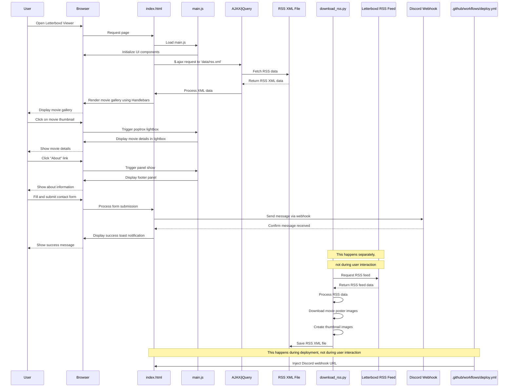

# Letterboxd Viewer Sequence Diagram

```mermaid
sequenceDiagram
    participant User
    participant Browser
    participant IndexHTML as index.html
    participant MainJS as main.js
    participant AJAX as AJAX/jQuery
    participant RSS as RSS XML File
    participant Python as download_rss.py
    participant Letterboxd as Letterboxd RSS Feed
    participant Discord as Discord Webhook
    participant InjectWebhook as .github/workflows/deploy.yml

    %% Initial page load
    User->>Browser: Open Letterboxd Viewer
    Browser->>IndexHTML: Request page
    IndexHTML->>MainJS: Load main.js
    MainJS->>Browser: Initialize UI components
    
    %% RSS data loading
    IndexHTML->>AJAX: $.ajax request to 'data/rss.xml'
    AJAX->>RSS: Fetch RSS data
    RSS-->>AJAX: Return RSS XML data
    AJAX->>IndexHTML: Process XML data
    IndexHTML->>Browser: Render movie gallery using Handlebars
    Browser-->>User: Display movie gallery
    
    %% User interaction with gallery
    User->>Browser: Click on movie thumbnail
    Browser->>MainJS: Trigger poptrox lightbox
    MainJS->>Browser: Display movie details in lightbox
    Browser-->>User: Show movie details
    
    %% User interaction with footer
    User->>Browser: Click "About" link
    Browser->>MainJS: Trigger panel show
    MainJS->>Browser: Display footer panel
    Browser-->>User: Show about information
    
    %% Contact form submission
    User->>Browser: Fill and submit contact form
    Browser->>IndexHTML: Process form submission
    IndexHTML->>Discord: Send message via webhook
    Discord-->>IndexHTML: Confirm message received
    IndexHTML->>Browser: Display success toast notification
    Browser-->>User: Show success message
    
    %% Behind the scenes: RSS download process
    Note over Python,Letterboxd: This happens separately, 
    Note over Python,Letterboxd: not during user interaction
    Python->>Letterboxd: Request RSS feed
    Letterboxd-->>Python: Return RSS feed data
    Python->>Python: Process RSS data
    Python->>Python: Download movie poster images
    Python->>Python: Create thumbnail images
    Python->>RSS: Save RSS XML file
    
    %% Behind the scenes: Webhook injection (during deployment)
    Note over InjectWebhook,IndexHTML: This happens during deployment, not during user interaction
    InjectWebhook->>IndexHTML: Inject Discord webhook URL
```
