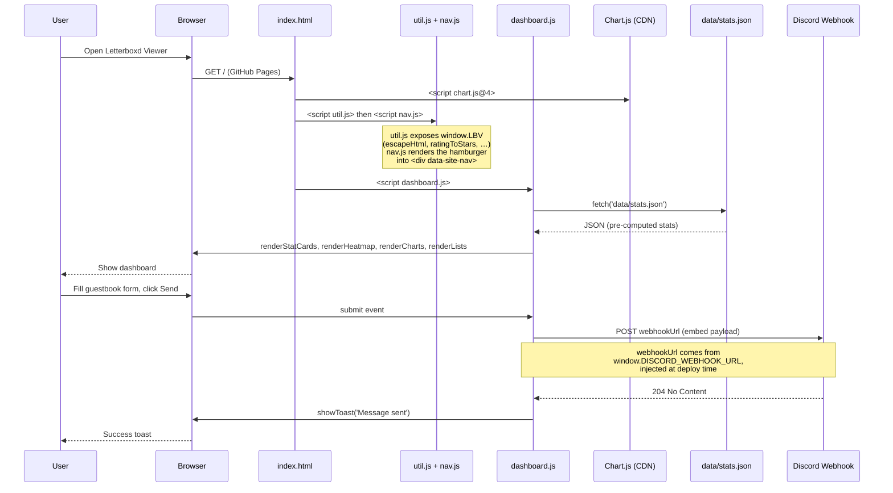
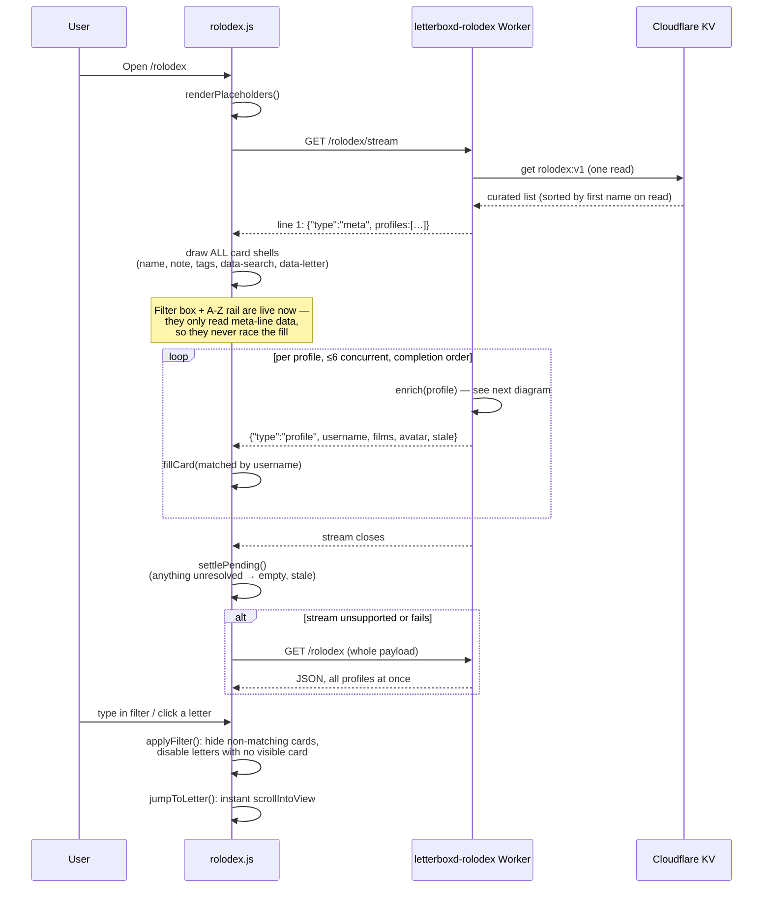
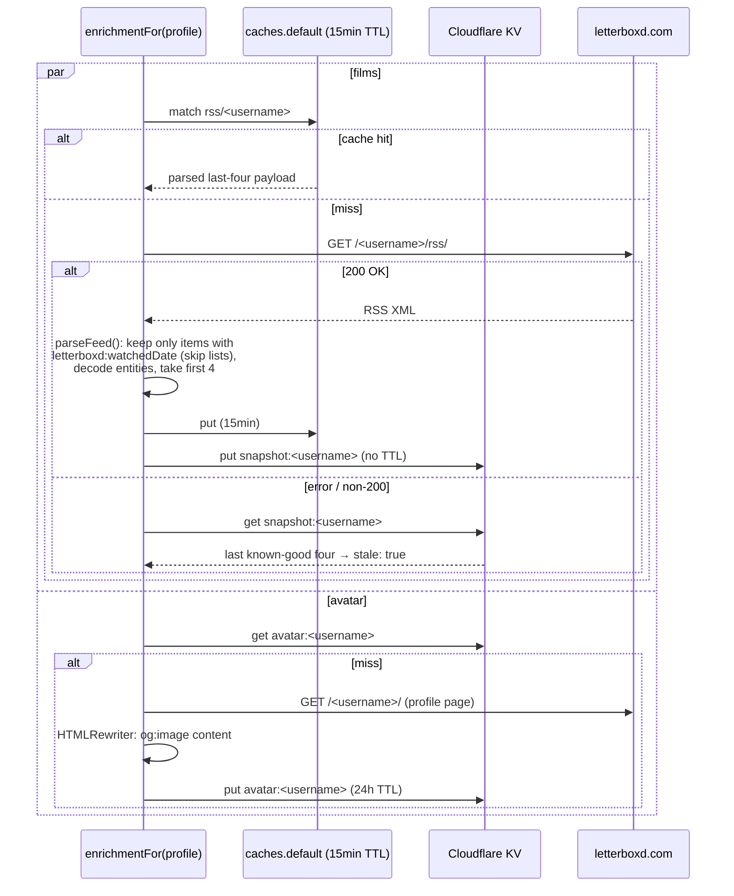
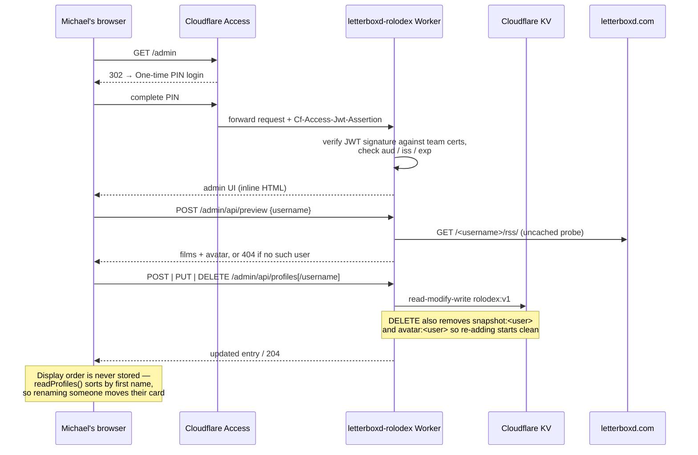
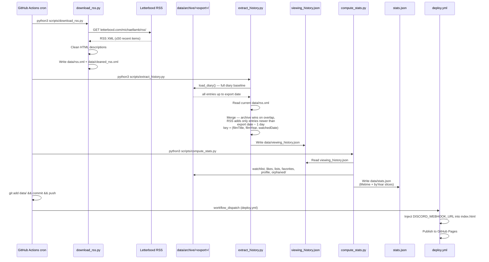

# Letterboxd Viewer Sequence Diagrams

How the two pages load (stats dashboard + rolodex), how the rolodex Worker
enriches profiles, how the admin curates them, and how the cron pipeline
refreshes the stats data.

## Runtime: stats dashboard (`index.html`)

## Runtime: rolodex (`rolodex.html`, NDJSON streaming)

Letterboxd serves RSS with **no CORS headers**, so friends' feeds can never be
fetched browser-side — everything goes through the Worker at
`rolodex.michaellamb.dev`. The page loads over a stream: cards render from the
curated list before a single feed has resolved, then fill in as profile lines
arrive in **completion order**.

## Worker: enriching one profile

Per-profile caching is what shields letterboxd.com — each feed is fetched at
most once per 15 minutes no matter how many visitors arrive. Snapshots make a
failing feed degrade to "last known good, flagged stale" instead of a blank card.

## Admin: curating the rolodex (`/admin`, Cloudflare Access)

The hostname is mixed: `GET /rolodex*` is public, only `/admin*` sits behind
Access (path-scoped app, One-time PIN). The Worker also verifies the Access JWT
itself, so a missing or misconfigured Access app fails closed.

## Data pipeline (cron, every 6 hours — stats dashboard only)

The rolodex does not touch this pipeline; it is entirely Worker + KV.

## Key ideas

- **Archive + RSS merge.** Letterboxd's RSS only exposes the ~50 most recent
  diary entries. The full history comes from a Letterboxd export archive under
  `data/archive/`; RSS layers on only entries logged **after** the export date.
  The archive wins on overlap, which also lets its deletions stick. (An earlier
  design reconstructed history by walking every git commit of `data/rss.xml`;
  the archive replaced that.)
- **Two data planes.** The stats dashboard is fully static — pre-computed JSON,
  refreshed by cron, no runtime backend. The rolodex is fully live — Worker +
  KV, no cron involvement. Neither depends on the other; they share only the
  static shell (CSS, `util.js`, `nav.js`).
- **Streaming beats caching harder.** All per-profile cache entries are filled
  by whichever request finds them empty, so they expire together ~15min later.
  Rather than making the unlucky cold visitor wait on the slowest of 60+ feeds,
  the stream gives them every card instantly and fills posters as feeds resolve.
