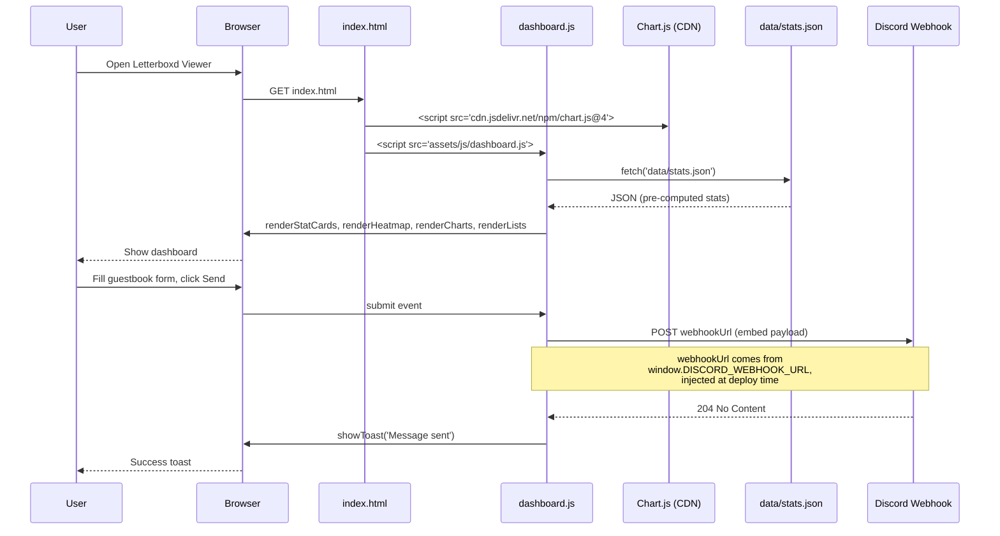
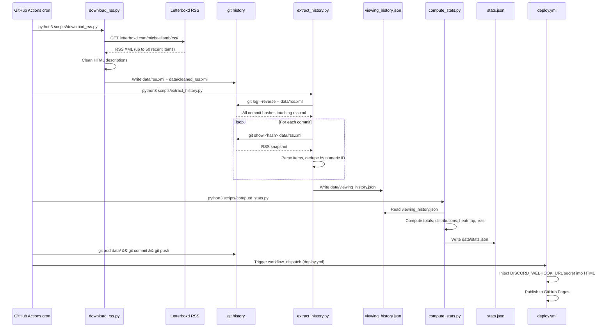

# Letterboxd Viewer Sequence Diagram

How the dashboard loads, how the cron pipeline refreshes data, and how the guestbook form posts to Discord.

## Runtime (page load + user interactions)

## Data pipeline (cron, runs every 6 hours)

## Key idea: cumulative history from git

Letterboxd's RSS only exposes the 50 most recent diary entries. To build a full history, `extract_history.py` walks **every** commit that has ever touched `data/rss.xml` and deduplicates entries by their numeric Letterboxd ID. The longer the cron has been running, the deeper the history goes. This is why the workflow checkout uses `fetch-depth: 0`.
